# 👨‍💻 Programación Android: Prototipo 2 (Actividad 15%) 
## Implementación de Intents y Threads

Este proyecto implementa y valida la comunicación entre componentes (Activities y Services) mediante **Intents** explícitos e implícitos, cumpliendo con la exigencia de incorporar **Threads** para la ejecución en segundo plano.

| Criterio | Valor |
| :--- | :--- |
| **Android SDK (Compilación)** | 36 |
| **AGP** | 8.12.0 |
| **Mínimo SDK** | 31 |

---

## 🚀 Requisitos de la Actividad: 8 Intents Funcionales

Se han implementado **5 Intents Implícitos** y **3 Intents Explícitos** que cumplen los requerimientos de la rúbrica.

### 🥇 Intents Explícitos (3/3)

| N° | Evento Explícito | Funcionalidad y Pasos de Prueba |
| :--- | :--- | :--- |
| **1.** | **PerfilActivity (Con Resultado)** | **Requisito: Devuelve Respuesta (Explícito #4).** 
1. Presionar "Ir a Perfil (resultado)".
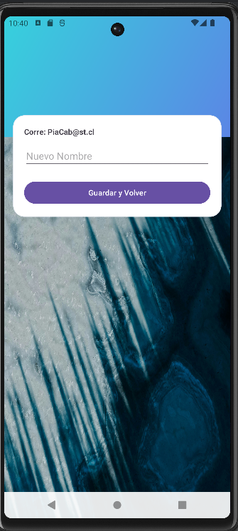
2. Escribir un nuevo nombre (ej: "Pia ST").
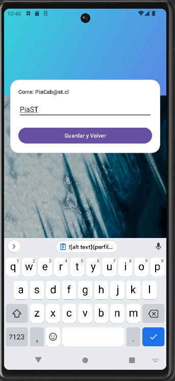
3. Presionar "Guardar y Volver".
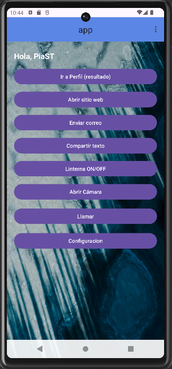
4. El mensaje de bienvenida en `HomeActivity` debe cambiar. |
| **2.** | **MiServicio (Service Interno)** | **Requisito: Lanzar un Service (Explícito #7) con Thread.** 
1. Abrir el menú de tres puntos (Toolbar). 
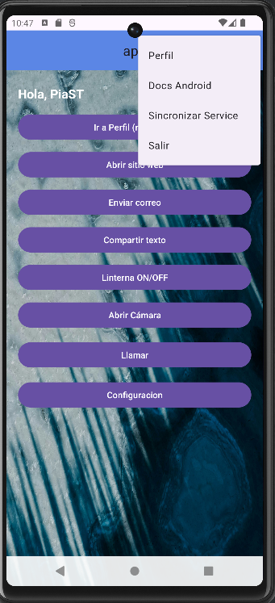
2. Seleccionar "Sincronizar Service". 
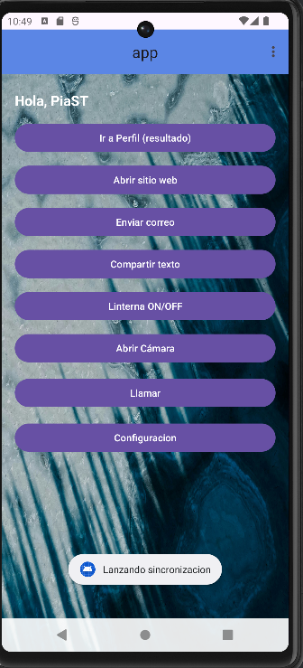
3. Un Toast confirma la "Sincronización Iniciada". 
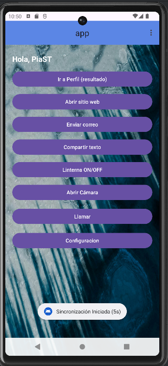
4. Después de 5 segundos, un segundo Toast confirma la finalización (prueba la ejecución en background). |
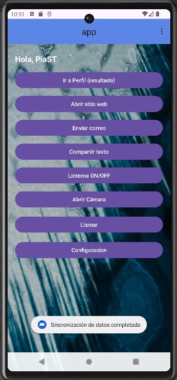
| **3.** | **CamaraActivity** | **Requisito: Navegación Simple (Explícito #6).** 
1. Presionar "Abrir Cámara".
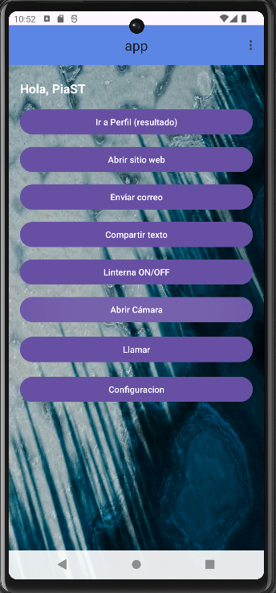
2. La aplicación debe navegar a la `CamaraActivity`. |

### 🥈 Intents Implícitos (5/5)

| N° | Evento Implícito | Funcionalidad y Pasos de Prueba |
| :--- | :--- | :--- |
| **1.** | **Ver una Página Web** | **Requisito #2: `ACTION_VIEW` con `https`.** 
1. Presionar "Abrir sitio web". 

2. Debe abrir la URL de Playstation en el navegador externo. |

| **2.** | **Enviar Correo Electrónico** | **Requisito #4: `ACTION_SENDTO` con `mailto:`.** 
1. Presionar "Enviar correo". 

2. Debe abrir el selector de apps de correo con el email y asunto prellenados. |
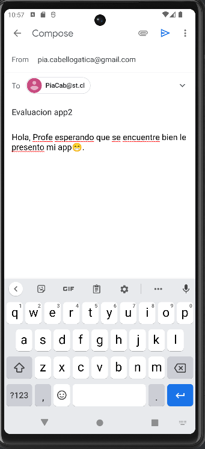

| **3.** | **Compartir Texto** | **Requisito: `ACTION_SEND` genérico.**
1. Presionar "Compartir texto". 

2. Debe abrir el selector de apps para enviar el mensaje. |
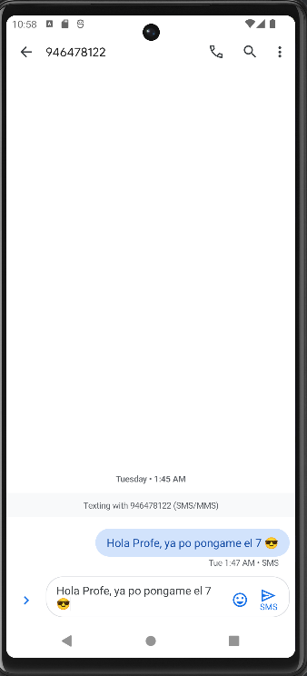

| **4.** | **Llamar (marcador)** | **Requisito #3: `ACTION_DIAL`.** 
1. Presionar "Llamar". 
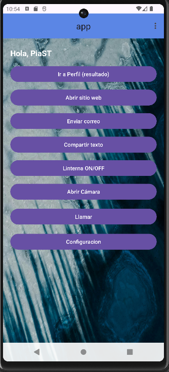
2. Debe abrir la aplicación de teléfono con el número prellenado. |
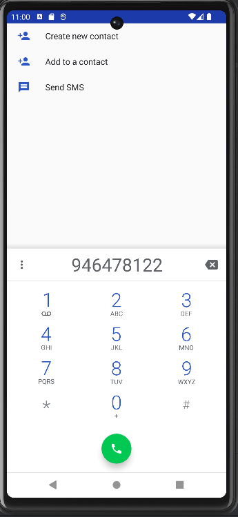

| **5.** | **Seleccionar Imagen (Galería)** | **Requisito #6: `ACTION_GET_CONTENT` / `image/*`.** 
1. Presionar "Abrir Cámara" y luego "Galería". 
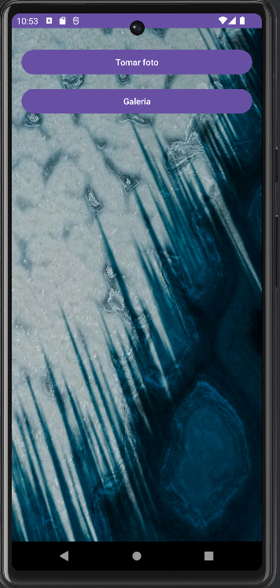
2. Debe abrir el selector de archivos y mostrar la imagen seleccionada en el preview. |
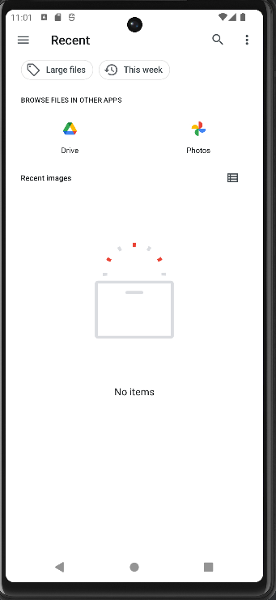

---

## 🛠️ Incorporación de Threads (Criterio 3)

1.  **Login:** Se utiliza un **`Handler`** en `LoginActivity.java` para simular una carga de 2 segundos antes de ingresar a la app.
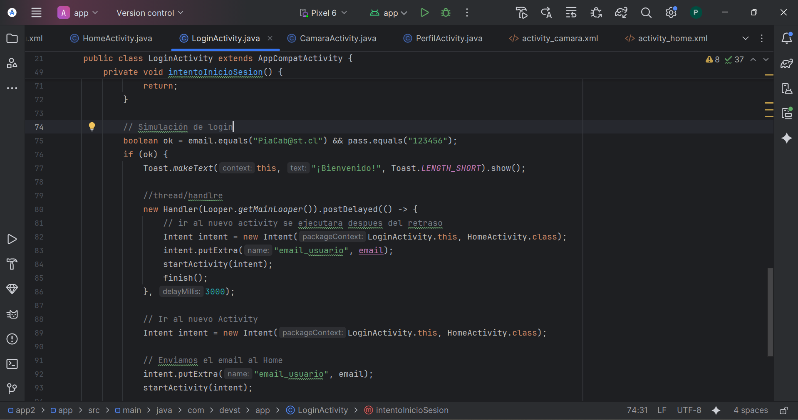
2.  **Service:** La clase `MiServicio.java` utiliza un **`Thread`** interno para realizar la simulación de sincronización de 5 segundos en segundo plano.
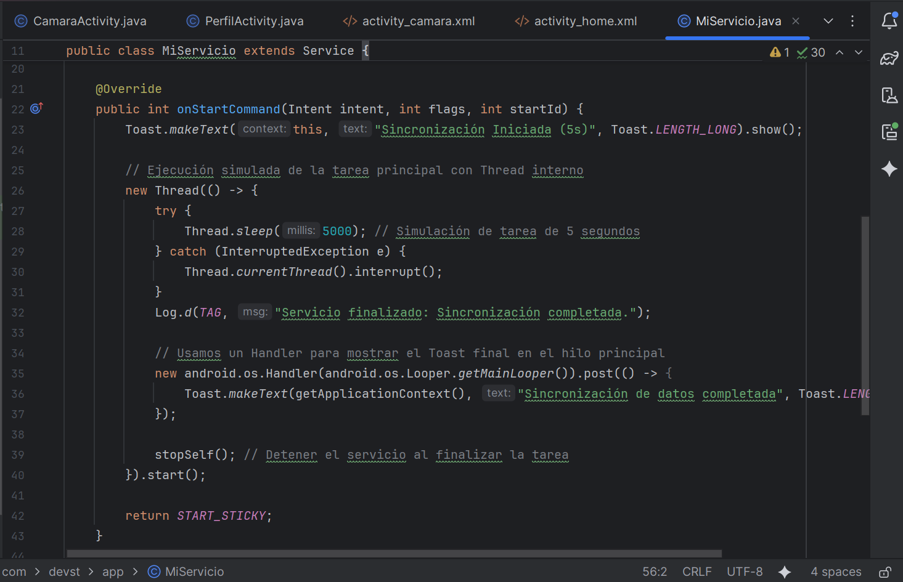

---

